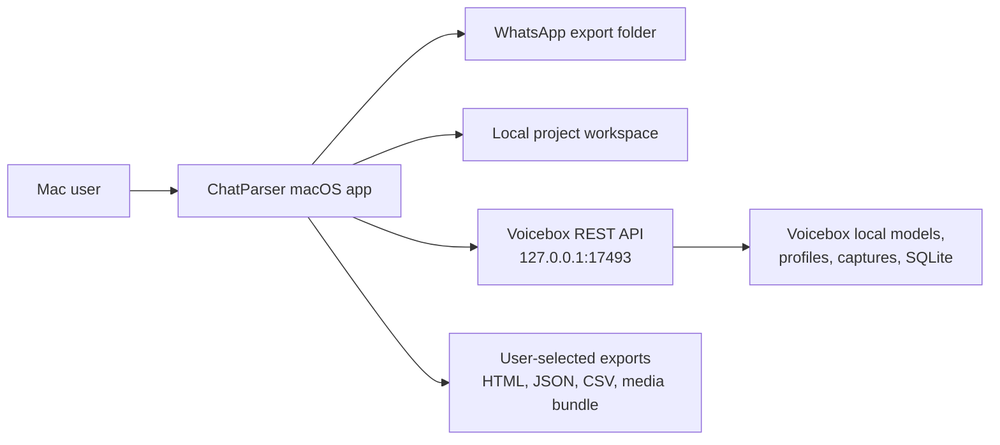
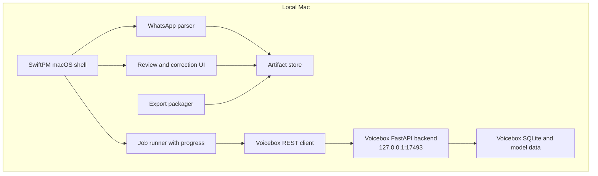

# Architecture

## Product Summary

ChatParser will become a Mac-first local desktop app for transforming WhatsApp
exports and attached multimedia into searchable, editable, and optionally
voice-generated local artifacts. The app targets a single local user working on
their own machine. It keeps WhatsApp source exports, derived transcripts, media
renders, summaries, and voice outputs on local storage unless the user manually
exports them.

Voicebox integration is through its local REST API at
`http://127.0.0.1:17493`. ChatParser does not import Whisper, Voicebox Python
modules, or model runtimes directly. Voicebox owns speech-to-text, text-to-speech,
model downloads, GPU runtime selection, voice profiles, and its SQLite-backed
capture/profile storage. ChatParser owns WhatsApp parsing, job orchestration,
local artifact metadata, user review state, and export packaging.

Evidence from the upstream Voicebox README:

- Voicebox exposes a REST API for voice I/O at `http://127.0.0.1:17493`.
- `POST /transcribe` accepts multipart form data with `file` and `model`.
- `POST /generate` accepts JSON with `text`, `profile_id`, and `language`.
- `GET /profiles` lists voice profiles.
- Voicebox states that models, voice data, and captures remain local.
- Voicebox uses a FastAPI backend and SQLite database.

Source: <https://github.com/jamiepine/voicebox/blob/main/README.md>

## Goals

- Import WhatsApp chat `.txt` exports and media folders without modifying source
  files.
- Normalize messages, participants, attachments, and derived artifacts into a
  local project workspace.
- Transcribe audio and video attachments by sending copied or staged media to
  Voicebox `POST /transcribe`.
- Generate replacement narration, accessibility audio, or synthetic review clips
  through Voicebox `POST /generate`.
- Provide clear progress for every folder/file loop, including ETA where enough
  work units are known.
- Run well on macOS as a SwiftPM-built shell around local processing and
  localhost services.

## Non-Goals

- No cloud transcription or speech generation.
- No direct Whisper imports in ChatParser.
- No mutation of original WhatsApp exports.
- No multi-user server or remote collaboration in the MVP.
- No automated upload to WhatsApp, iCloud, Google Drive, or social platforms.
- No legal discovery guarantees beyond documented local processing controls.

## C4 Context

## Container View

## Components

| Component | Responsibility | Notes |
|---|---|---|
| macOS shell | File picker, project selection, settings, job launch, review screens | SwiftPM-first native shell per ADR-001. |
| WhatsApp parser | Parse iPhone `_chat.txt` and Android `WhatsApp Chat with <name>.txt` files, then associate attachment references with files | Parser must tolerate locale-specific timestamps and missing media. |
| Media normalizer | Copy or hard-link allowed media into project staging | Must never rewrite source exports. |
| Job runner | Batch transcription, generation, transformation, export | Must display file-level progress and ETA for folder/file loops. |
| Voicebox REST client | Typed client for `/transcribe`, `/generate`, `/profiles` | Uses localhost HTTP only; no direct model imports. |
| Artifact store | Project metadata, transcript text, generated audio paths, checksums | Local SQLite plus project folders. |
| Review UI | Let user edit transcript, speaker, timestamp, notes, and output labels | Edits are versioned as local revisions. |
| Export packager | Build HTML, JSON, CSV, Markdown, and media bundles | Exports include provenance manifest. |

## Primary Data Flows

### Import WhatsApp Export

1. User selects a WhatsApp export folder or ZIP.
2. App creates a project workspace under the configured local artifact root.
3. App parses chat text into message records.
4. App resolves attachment references to local files.
5. App copies, hard-links, or records references according to project settings.
6. App computes checksums and writes import manifest.
7. UI reports progress over parsed lines and attachment files with ETA.

### Transcribe Multimedia

1. User selects attachments or starts a project-level transcription job.
2. Job runner filters audio/video files without accepted transcript versions.
3. For each file, app sends `multipart/form-data` to
   `POST http://127.0.0.1:17493/transcribe` with fields `file` and `model`.
4. Voicebox returns transcript data.
5. App stores transcript version, confidence metadata if available, model name,
   source checksum, and Voicebox endpoint metadata.
6. Review UI marks transcript as machine-generated until user accepts or edits.

### Generate Audio

1. User selects message text, summary text, or edited transcript.
2. App loads Voicebox profiles through `GET /profiles`.
3. User picks profile and language.
4. App sends JSON to `POST http://127.0.0.1:17493/generate` with `text`,
   `profile_id`, and `language`.
5. Returned audio artifact is stored in the project and linked to source text.

## Runtime Dependencies

| Dependency | Required For | Failure Mode |
|---|---|---|
| Voicebox app/backend running on `127.0.0.1:17493` | Transcription, generation, profile list | UI shows service unavailable and offers retry. |
| Apple AVKit/AVFoundation system frameworks | Inline audio/video playback in the macOS chat view | Unsupported codecs remain openable through the system Open action. |
| Local disk workspace | Project database and media artifacts | Import/export blocked until valid writable path selected. |
| macOS file permissions | Access to user-selected export folders | File picker scoped access requested again. |
| Optional ffmpeg or AVFoundation helpers | Video audio extraction if Voicebox requires audio-only input | Job records unsupported media transform error. |

## Observability

- Each long-running job writes append-only local job events.
- Progress output includes phase, completed count, total count, current file, and
  ETA when total work units are known.
- Voicebox calls log endpoint, model, project id, artifact id, duration, status
  code, retry count, and response size. Logs never include message text or full
  transcript by default.
- Import and export manifests include source paths, checksums, record counts,
  generated artifact paths, and tool versions.

## Constraints

- Localhost REST calls must be time-bounded and cancellable.
- Voicebox API shape is treated as external and version-sensitive; integration
  tests should validate endpoints against the running local server.
- Project database schema must allow re-transcription with different Voicebox
  models without overwriting prior transcript versions.
- User-facing deletion must support project-local artifacts while preserving
  source WhatsApp exports by default.
