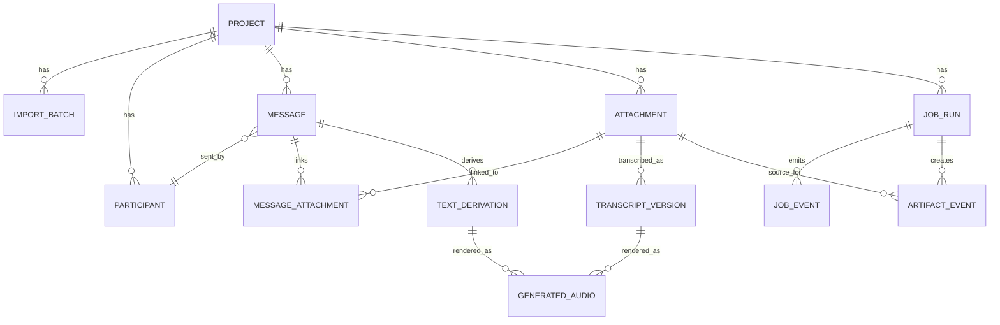

# Data Model

## Storage Boundary

Chatparser stores its own project metadata and derived artifacts in a local
workspace. Voicebox stores its own models, voice profiles, captures, and SQLite
data. Chatparser references Voicebox profile identifiers and endpoint metadata,
but it does not read or write Voicebox SQLite directly.

Recommended project layout:

```text
<artifact-root>/
  projects/
    <project-id>/
      chatparser.sqlite
      import/
        source-manifest.json
      media/
        original/
        normalized/
      transcripts/
      generated-audio/
      exports/
      logs/
```

## Entity Relationship Diagram



## Core Tables

### project

| Field | Type | Required | Description |
|---|---:|---:|---|
| id | UUID | Yes | Stable project identifier. |
| name | Text | Yes | User-visible project name. |
| artifact_root | Text | Yes | Absolute local path to project root. |
| created_at | Timestamp | Yes | Project creation time. |
| updated_at | Timestamp | Yes | Last metadata update. |
| settings_json | JSON | Yes | Project settings such as copy mode and default Voicebox model. |

### import_batch

| Field | Type | Required | Description |
|---|---:|---:|---|
| id | UUID | Yes | Import attempt identifier. |
| project_id | UUID | Yes | Parent project. |
| source_kind | Text | Yes | `folder`, `zip`, or `single-chat-file`. |
| source_path | Text | Yes | User-selected source path. |
| source_hash | Text | No | Hash of ZIP or manifest hash for folders. |
| started_at | Timestamp | Yes | Import start. |
| completed_at | Timestamp | No | Import completion. |
| status | Text | Yes | `running`, `completed`, `failed`, or `cancelled`. |
| summary_json | JSON | Yes | Counts for lines, messages, attachments, skipped files. |

### participant

| Field | Type | Required | Description |
|---|---:|---:|---|
| id | UUID | Yes | Local participant id. |
| project_id | UUID | Yes | Parent project. |
| display_name | Text | Yes | Name parsed from WhatsApp export. |
| normalized_name | Text | Yes | Canonical lookup value. |
| aliases_json | JSON | Yes | User-managed alternate names. |

### message

| Field | Type | Required | Description |
|---|---:|---:|---|
| id | UUID | Yes | Message id. |
| project_id | UUID | Yes | Parent project. |
| import_batch_id | UUID | Yes | Source import batch. |
| participant_id | UUID | No | Sender when parsed. |
| sent_at | Timestamp | No | Parsed local timestamp. |
| sequence_index | Integer | Yes | Stable order within import. |
| body | Text | Yes | Message body after parser normalization. |
| raw_line | Text | Yes | Source line or merged raw text. |
| parse_confidence | Real | Yes | Parser confidence from 0.0 to 1.0. |
| flags_json | JSON | Yes | `system-message`, `deleted`, `edited`, `parse-warning`, etc. |

### attachment

| Field | Type | Required | Description |
|---|---:|---:|---|
| id | UUID | Yes | Attachment id. |
| project_id | UUID | Yes | Parent project. |
| import_batch_id | UUID | Yes | Source import batch. |
| source_path | Text | Yes | Original source file path. |
| stored_path | Text | No | Project-local copy or normalized media path. |
| media_kind | Text | Yes | `audio`, `video`, `image`, `document`, or `unknown`. |
| mime_type | Text | No | Detected MIME type. |
| byte_size | Integer | Yes | File size in bytes. |
| sha256 | Text | Yes | Content checksum. |
| duration_ms | Integer | No | Media duration when known. |
| status | Text | Yes | `available`, `missing`, `unsupported`, `error`. |

### message_attachment

| Field | Type | Required | Description |
|---|---:|---:|---|
| message_id | UUID | Yes | Message id. |
| attachment_id | UUID | Yes | Attachment id. |
| relation | Text | Yes | `referenced`, `inferred`, or `manual`. |

### transcript_version

| Field | Type | Required | Description |
|---|---:|---:|---|
| id | UUID | Yes | Transcript version id. |
| attachment_id | UUID | Yes | Source attachment. |
| job_run_id | UUID | Yes | Producing job. |
| voicebox_url | Text | Yes | Expected value `http://127.0.0.1:17493/transcribe`. |
| voicebox_model | Text | Yes | Model form field, for example `whisper-turbo`. |
| transcript_text | Text | Yes | Returned or edited transcript. |
| language | Text | No | Detected or user-selected language. |
| status | Text | Yes | `machine`, `reviewed`, `edited`, `rejected`. |
| created_at | Timestamp | Yes | Version creation time. |
| edited_at | Timestamp | No | Last human edit time. |
| provenance_json | JSON | Yes | Endpoint, source checksum, duration, response metadata. |

### text_derivation

| Field | Type | Required | Description |
|---|---:|---:|---|
| id | UUID | Yes | Derived text id. |
| project_id | UUID | Yes | Parent project. |
| source_kind | Text | Yes | `message`, `transcript`, `selection`, or `summary`. |
| source_id | UUID | No | Source entity id when applicable. |
| derivation_kind | Text | Yes | `cleaned`, `summary`, `translation`, `redaction`, `manual-note`. |
| text | Text | Yes | Derived text. |
| created_at | Timestamp | Yes | Creation time. |
| provenance_json | JSON | Yes | Transform metadata and source ids. |

### generated_audio

| Field | Type | Required | Description |
|---|---:|---:|---|
| id | UUID | Yes | Generated audio id. |
| project_id | UUID | Yes | Parent project. |
| source_kind | Text | Yes | `message`, `transcript_version`, or `text_derivation`. |
| source_id | UUID | Yes | Source entity id. |
| voicebox_url | Text | Yes | Expected value `http://127.0.0.1:17493/generate`. |
| voicebox_profile_id | Text | Yes | Profile id selected from `GET /profiles`. |
| language | Text | Yes | Language sent to Voicebox. |
| output_path | Text | Yes | Project-local generated audio file. |
| sha256 | Text | Yes | Output checksum. |
| created_at | Timestamp | Yes | Generation time. |
| provenance_json | JSON | Yes | Request metadata, profile label, endpoint, duration. |

### job_run

| Field | Type | Required | Description |
|---|---:|---:|---|
| id | UUID | Yes | Job id. |
| project_id | UUID | Yes | Parent project. |
| kind | Text | Yes | `import`, `transcribe`, `generate`, `export`, `cleanup`. |
| status | Text | Yes | `queued`, `running`, `completed`, `failed`, `cancelled`. |
| total_units | Integer | No | Known work units for progress. |
| completed_units | Integer | Yes | Completed work units. |
| started_at | Timestamp | No | Start time. |
| completed_at | Timestamp | No | Completion time. |
| error_summary | Text | No | User-safe error summary. |

### job_event

| Field | Type | Required | Description |
|---|---:|---:|---|
| id | UUID | Yes | Event id. |
| job_run_id | UUID | Yes | Parent job. |
| occurred_at | Timestamp | Yes | Event time. |
| level | Text | Yes | `debug`, `info`, `warning`, `error`. |
| phase | Text | Yes | Current phase. |
| message | Text | Yes | User-safe event text. |
| metadata_json | JSON | Yes | Current file, counts, ETA, retry metadata. |

### artifact_event

| Field | Type | Required | Description |
|---|---:|---:|---|
| id | UUID | Yes | Artifact event id. |
| job_run_id | UUID | Yes | Producing job. |
| source_attachment_id | UUID | No | Source media when applicable. |
| artifact_kind | Text | Yes | `normalized-media`, `transcript`, `generated-audio`, `export`. |
| artifact_path | Text | Yes | Local path. |
| sha256 | Text | No | Content checksum. |
| created_at | Timestamp | Yes | Creation time. |

## Indexes

- `message(project_id, sequence_index)` for timeline rendering.
- `message(project_id, sent_at)` for date navigation.
- `participant(project_id, normalized_name)` for sender resolution.
- `attachment(project_id, sha256)` for duplicate media detection.
- `transcript_version(attachment_id, created_at)` for version history.
- `generated_audio(project_id, source_kind, source_id)` for review UI lookups.
- `job_event(job_run_id, occurred_at)` for progress replay.

## Retention Semantics

- Source files are read-only and never deleted by Chatparser.
- Project-local artifacts can be deleted by project cleanup.
- Transcript and generated audio versions are append-only until user deletes a
  version or whole project.
- Export bundles are snapshots and include `source-manifest.json`,
  `provenance.json`, and checksums.
